# AcVis (Actors Smart Visualiser)

LINK PREZENTARE: https://youtu.be/271QYWqI0eg

## Contents

1. [Authors](#authors)

2. [Introduction](#introduction)

    1. [Purpose](#purpose)

    2. [Document convention](#document-convention)

    3. [Target audience](#target-audience)

    4. [The purpose of the application](#the-purpose-of-the-application)

    5. [Bibliography and references](#bibliography-and-references)

3. [General description](#general-description)

   1. [Product Perspective](#product-perspective)
      
   2. [Product Features](#product-features)
      
   3. [User Classes and Characteristics](#user-classes-and-characteristics)
      
   4. [Operating Environment](#operating-environment)
      
   5. [User Documentation](#user-documentation)

4. [Application Interface](#application-interface)

    1. [User interface](#user-interface)

        1. [Landing page](#landing-page)

        2. [Login page](#login-page)

        3. [Register page](#register-page)

        4. [Actors page](#actors-page)
       
        5. [Actor page](#actor-page) 
       
        6. [Error 400 page](#error-400-page)
       
        7. [Error 404 page](#error-404-page)
       
        8. [Error 500 page](#error-500-page)

        9. [Edit profile page](#edit-profile-page)

       10. [Statistics page](#statistics-page)
       
       11. [Shows Page](#shows-page)
       
       12. [Show Page](#show-page)
       
       13. [Awards Page](#awards-page)
       
       14. [Award Page](#award-page)
       
       15. [About page](#about-page)
       
       16. [Admin dashboard Page](#admin-dashboard-page)
       
       17. [See shows Page](#see-shows-page)
       
       18. [Add show Page](#add-show-page)
       
       19. [See actors Page](#see-actors-page)
       
       20. [Add award Page](#add-award-page)

    2. [Hardware interface](#hardware-interface)

    3. [Software interface](#software-interface)

    4. [Communication interface](#communication-interface)

5. [Characteristics of the application](#characteristics-of-the-application)

    1. [Account Management](#account-management)

    2. [Admin Section](#admin-section)
    
    3. [Session management](#session-management)

         1. [Description](#description)

         2. [Data flow](#data-flow)

         3. [Requirements and constraints](#requirements-and-constraints)

    4. [Other functionalities](#other-functionalities)

        1. [Description](#description)

        2. [Data flow](#data-flow)

        3. [Requirements and constraints](#requirements-and-constraints)

## Authors

Students in 2nd at UAIC, Faculty of Computer Science, group B4

- Frunză Alexandru-Ioan - [alex@alexfrunza.com](mailto:alex@alexfrunza.com)

- Ștefan Vlad - [vladstefan303@gmail.com](mailto:vladstefan303@gmail.com)

## Introduction

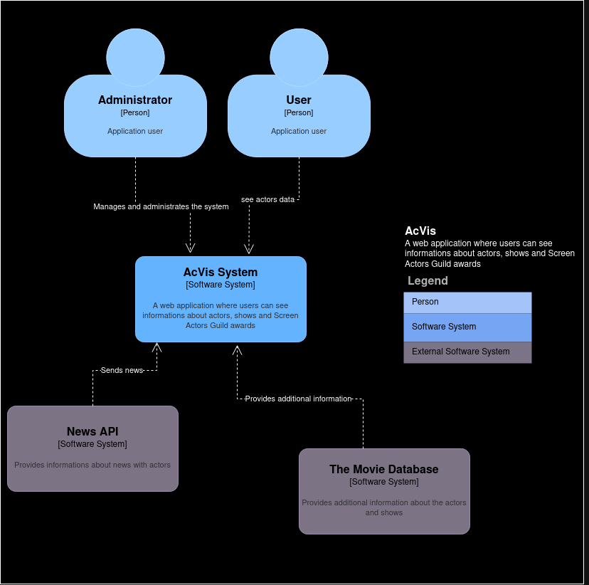

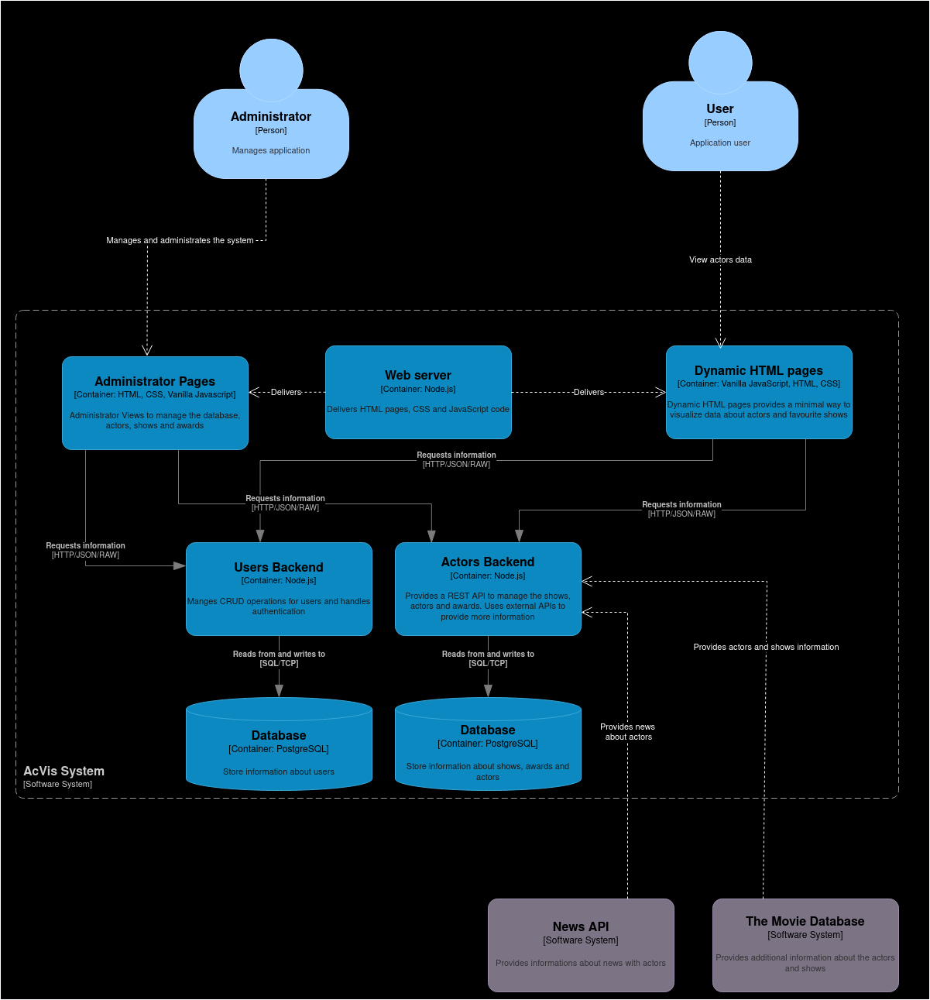

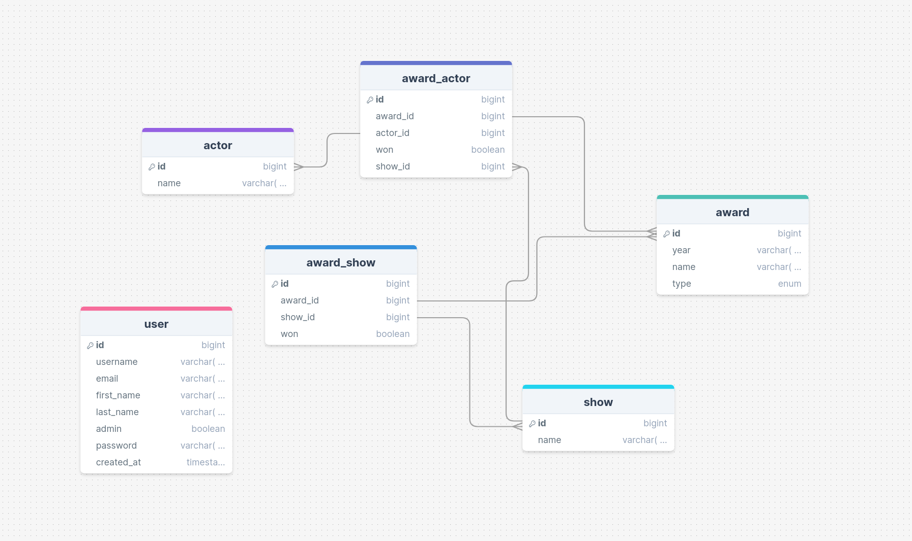

### Purpose

- The purpose of this application is to create a flexible web-based tool for visualizing data related to actor
  nominations
  for the Screen Actors Guild (SAG) Awards. This will be achieved through a custom-developed REST/GraphQL API.
  Additional
  information about each actor and their film productions will be fetched from The Movie Database (TMDb). The
  application
  will generate statistics and visualizations in at least three different ways. Users will have the ability to export
  these visualizations in CSV, WebP, and SVG formats. The system will also support displaying news related to each
  nominated actor, sourced from configurable external data feeds within the developed application. Additional resources
  related to data visualization will be provided within the application.

### Document convention

- This document is written in Markdown format. The document is structured in sections, each section containing a title
- This document follows the template for software requirements documentation according to the IEEE Software Requirements
  Specification.

### Target audience

- The target audience for this application encompasses a broad range of users. Entertainment industry professionals,
  such as casting directors, producers, agents, and filmmakers, will find the tool valuable for tracking actor
  nominations for the SAG Awards and gathering additional information about actors and their film productions. Movie
  enthusiasts and fans who want to stay updated with the latest nominations, news, and statistics related to their
  favorite actors and movies will also benefit from the application.

### The purpose of the application

- The purpose of this application is to create a flexible web-based tool for visualizing data related to actor
  nominations for the Screen Actors Guild (SAG) Awards. This visualization is achieved through a custom-developed
  REST/GraphQL API. Additionally, the application fetches additional information about each actor and their film
  productions from The Movie Database (TMDb).

- The application aims to generate statistics and visualizations in at least three different formats. Users will have
  the ability to export these visualizations in CSV, WebP, and SVG formats. Furthermore, the system supports displaying
  news related to each nominated actor, sourced from configurable external data feeds within the developed application.

### Bibliography and references

- Dr. Buraga Sabin-Corneliu, Dr. Andrei Panu, Daniel Isepciuc, website Tehnologii Web, FII UAIC

- [The Movie Database (TMDb)](https://www.themoviedb.org/)

- [Screen Actors Guild (SAG) Awards](https://www.sagawards.org/)

- [IEEE Software Requirements Specification](https://standards.ieee.org/standard/29148-1-2018.html)

- [Markdown Guide](https://www.markdownguide.org/)

- [REST API Tutorial](https://www.restapitutorial.com/)

- [JavaScript Tutorial](https://www.javascripttutorial.net/)

## General description

### Product Perspective
AcVis (Actors Smart Visualiser) is a web tool developed to provide flexible visualization of data regarding actors' nominations at the Screen Actors Guild (SAG) Awards, using a proprietary REST/GraphQL API. Additional information about each actor and film production will be retrieved from The Movie Database (TMDb). The system will also provide support for displaying news about each nominee, based on configurable external data sources within the developed application.

### Product Features
Users will have access to the following features:

- Authentication and registration on the website.
- Viewing of data regarding actors nominations at SAG Awards.
- Access to additional information about each actor and film production from TMDb.
- Generation and export of statistics and visualizations in CSV, WebP, and SVG formats.
- News about each nominee from external sources.

### User Classes and Characteristics

####  Primary User
Primary users may include:

- Movie enthusiasts interested in SAG Awards and actors performances.
- Film industry professionals who want to monitor and analyze actors' nominations.
#### Characteristics
Primary users can access data about actors nominations, additional information about actors and films, generated statistics and visualizations, as well as relevant news. They can customize the data visualization mode and export statistics and visualizations in various formats.

### Operating Environment
AcVis can be used on any device with a web browser that supports HTML5, CSS, and JavaScript.

### User Documentation
Users can refer to this document to understand the functionalities and operation mode of the AcVis application.

## Application Interface

### User Interface

#### Landing page

- The landing page will contain a presentation of the application and what is it about.

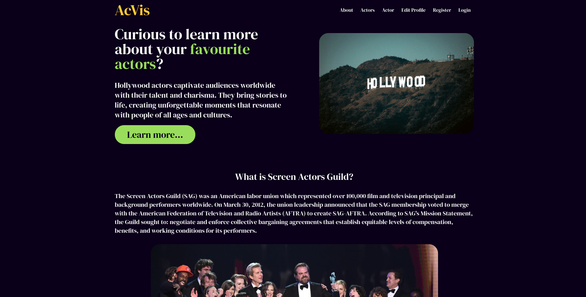

#### Login page

- The login page will contain a form where the user can enter their username and password to log in.

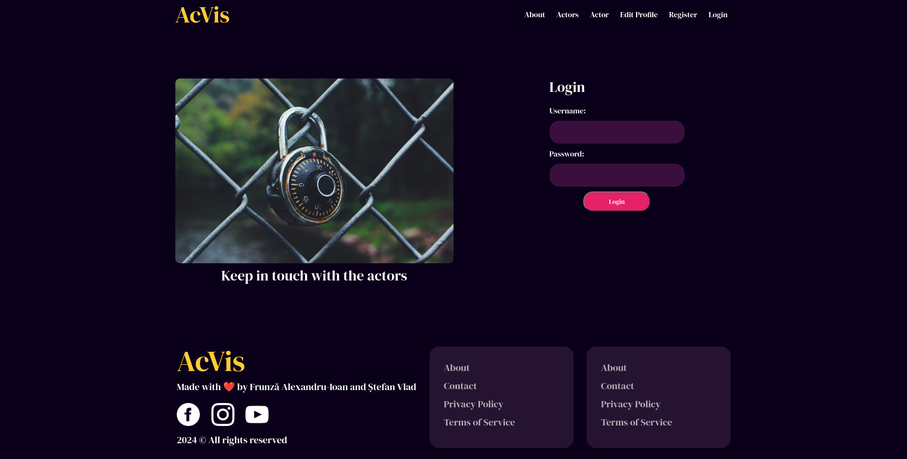

#### Register page

- The register page will contain a form where the user can enter their username, email, name and password to create an
  account.

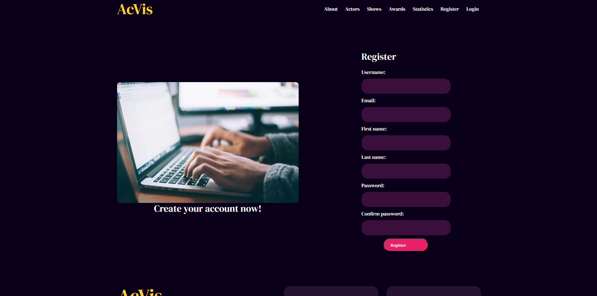

#### Actors page

- The actors page will contain a list of actors.

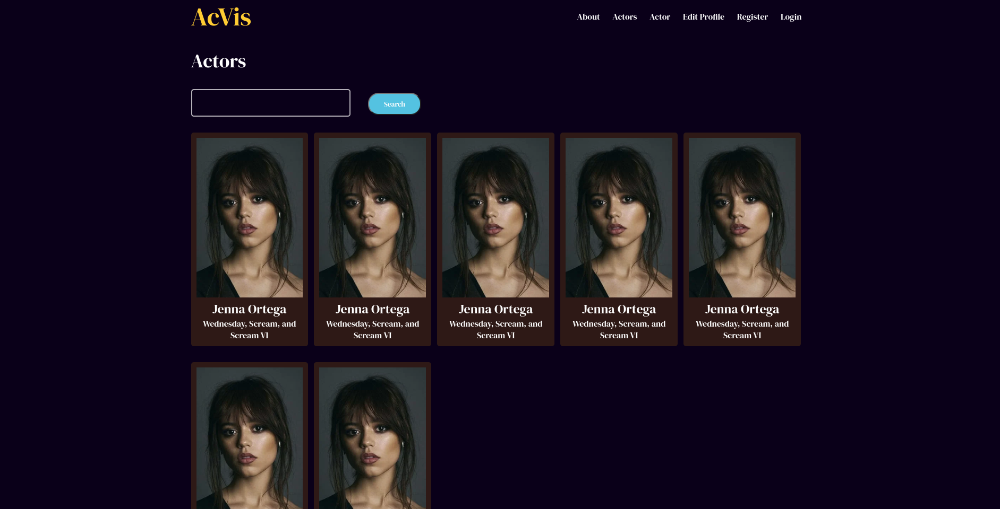

#### Actor page

- The actor's page will show information about an actor.

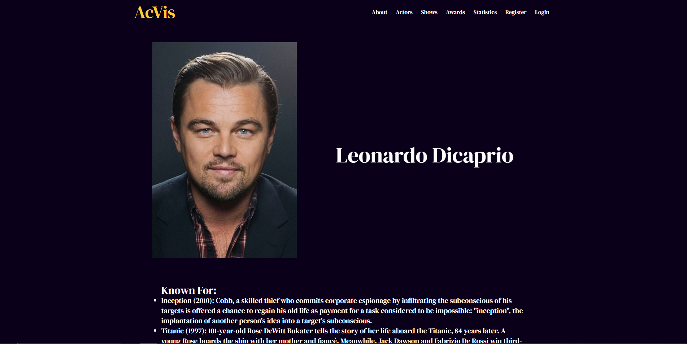

#### Error 400 page

- Error 400 page - Bad Request.

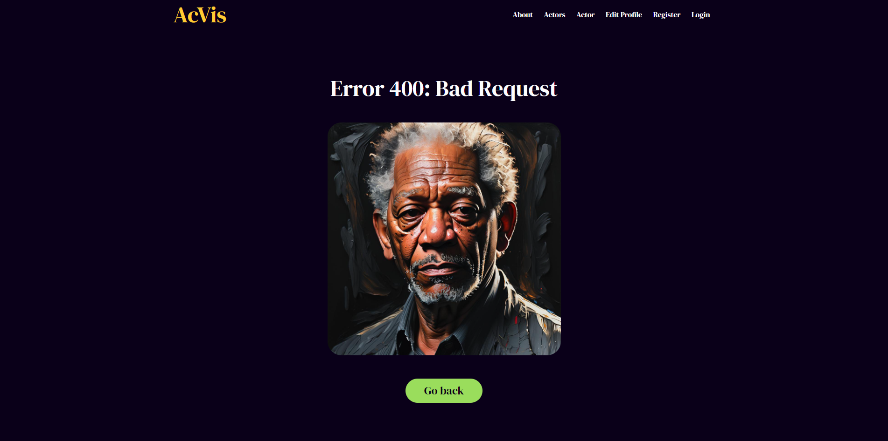

#### Error 404 page

- Error 404 page - Page not found.

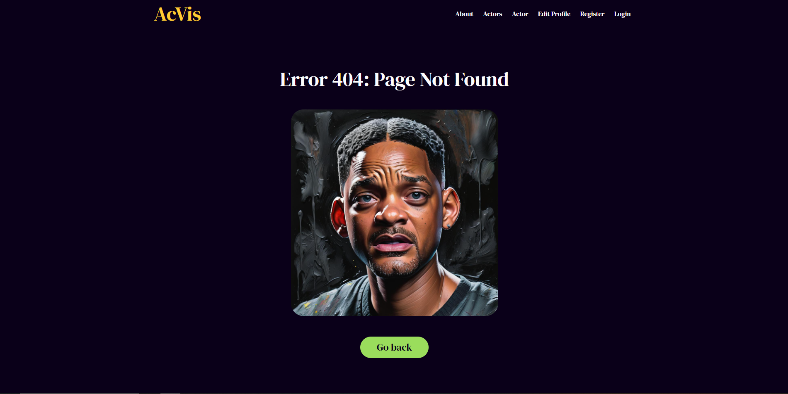

#### Error 500 page

- Error 500 page - Internal Server Error.

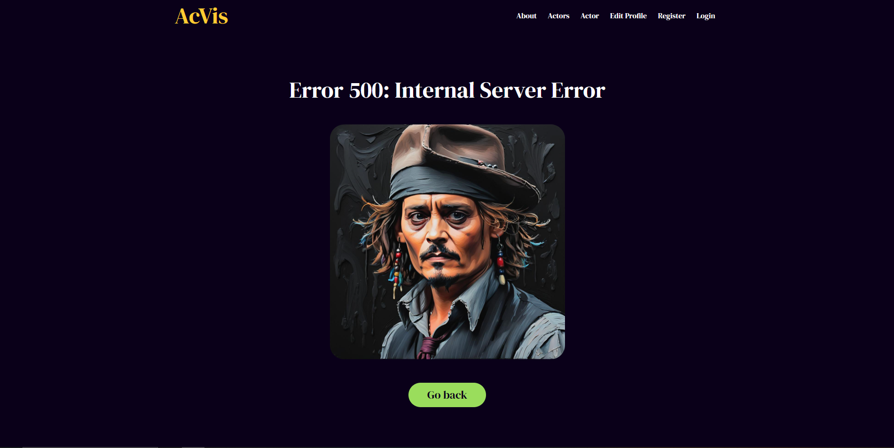

#### Edit profile page

- The edit profile page will contain a form where the user can edit their profile information.

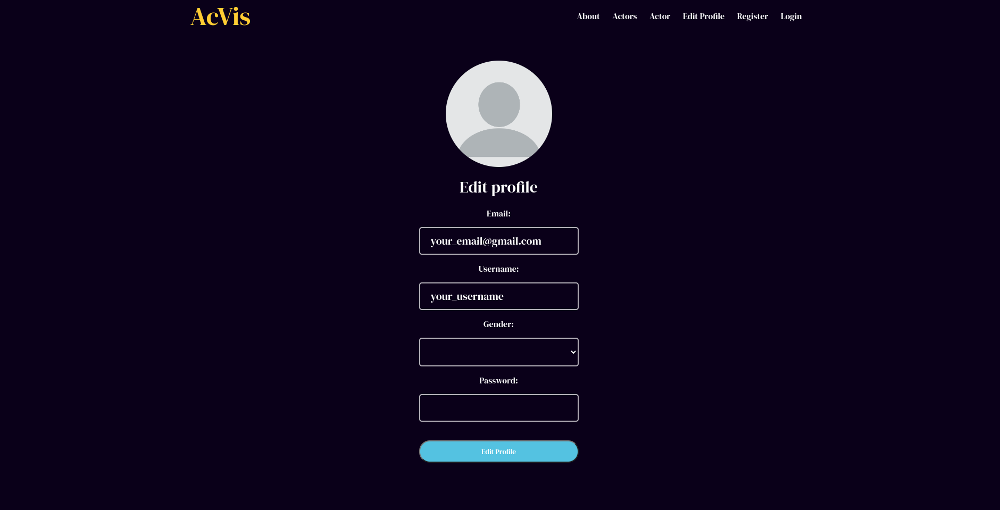

#### Statistics page

- The statistics page will contain visualizations of the data, such as pie charts, bar charts and line charts.

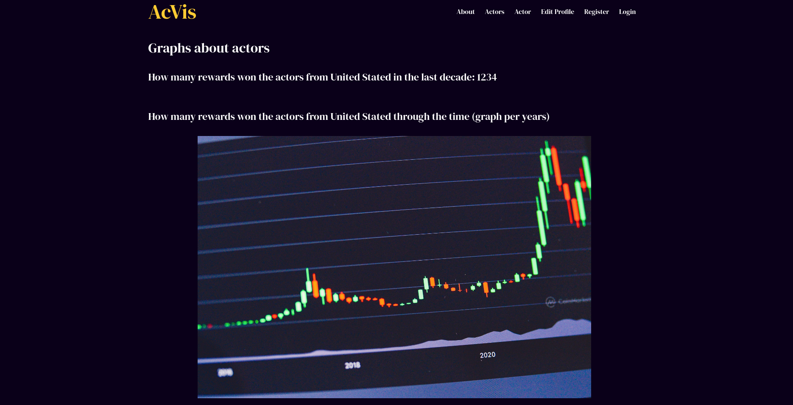

#### Shows Page

- The shows page will contain a list of shows.

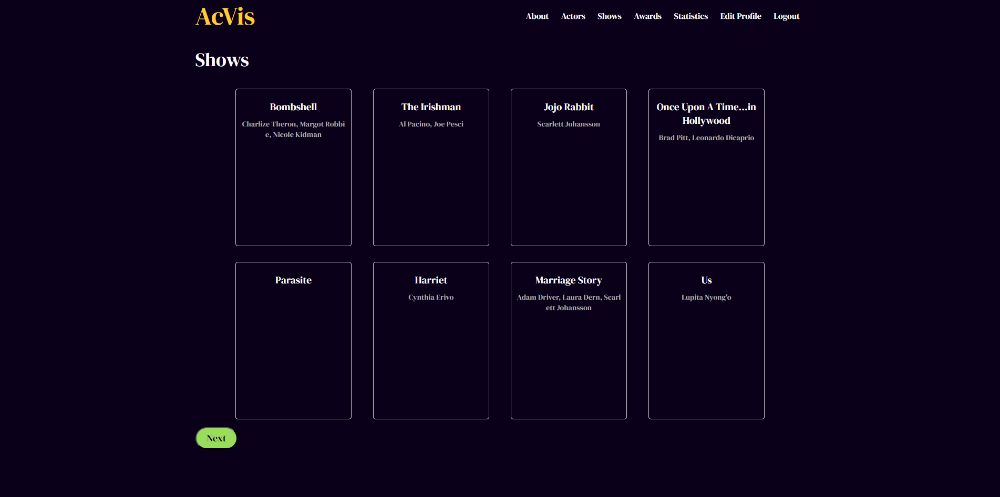

#### Show Page

- The show's page will show information about a show.

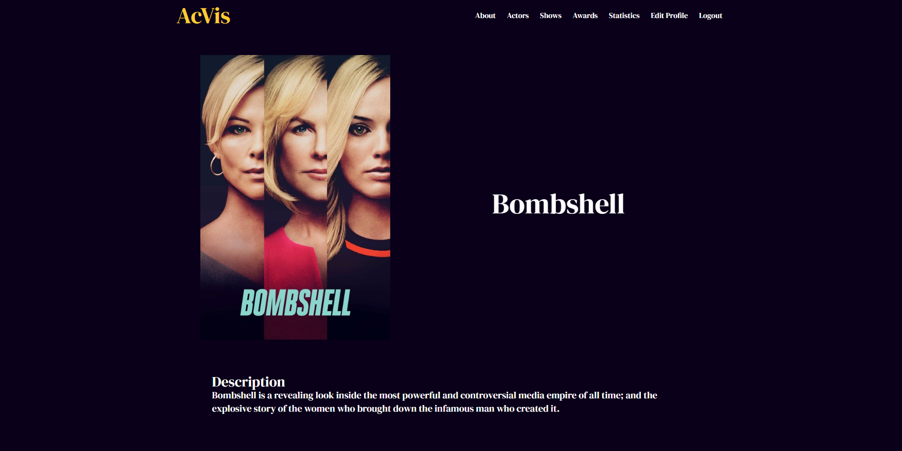

#### Awards Page

- The awards page will contain a list of awards.

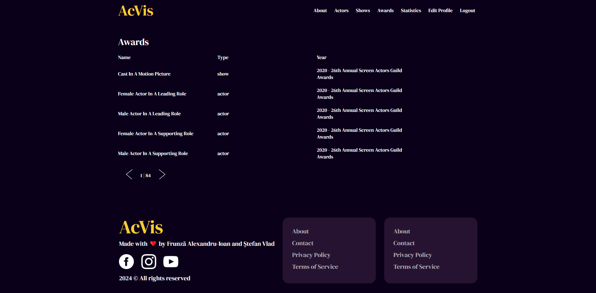

#### Award Page

- The award's page will show information about an award.

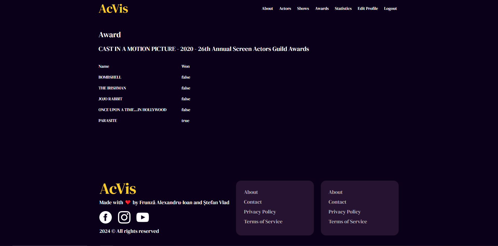

#### About page

- About page presents information about Screen Actors Guild.

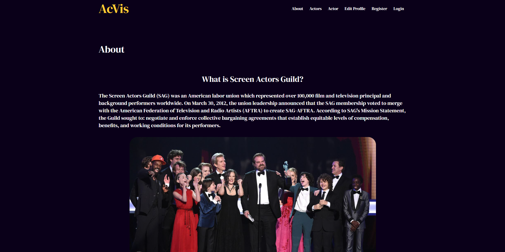

#### Admin dashboard Page

- Admin dashboard Page provides the admin with the ability to view a list of shows, actors, awards, to add and delete them, to import/export actors via CSV.

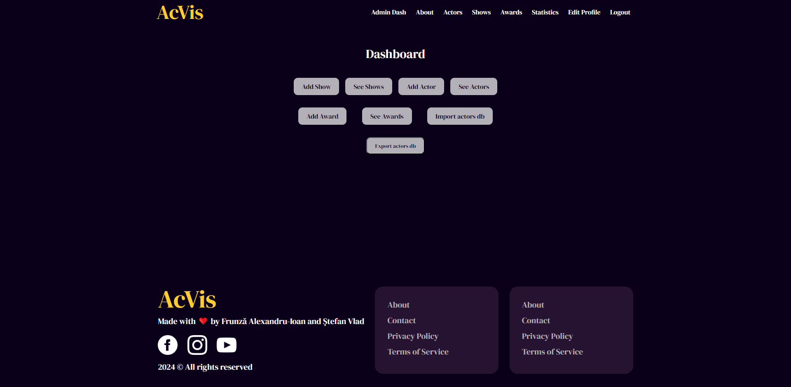

#### See shows Page

- See shows Page shows a list of shows and the ability to edit or delete a show.

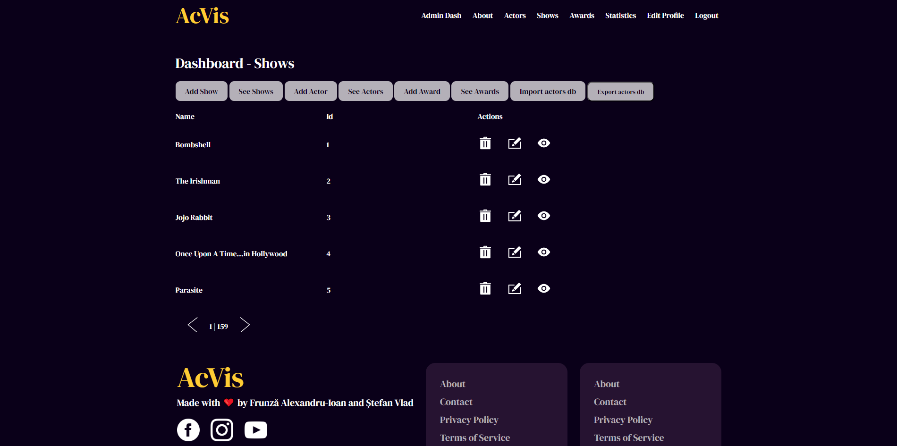

#### Add show Page

- Add show Page allows the admin to add a new show.

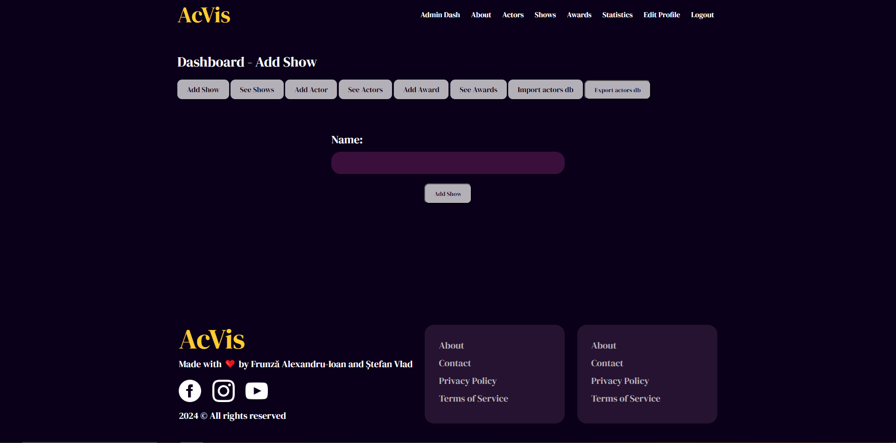

#### See actors Page

- See actors Page shows a list of actors and the ability to edit or delete an actor.

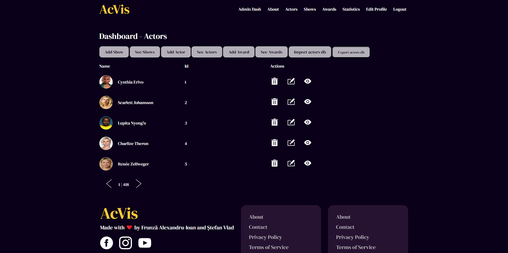

#### Add award Page

- Add award Page allows the admin to add a new award.

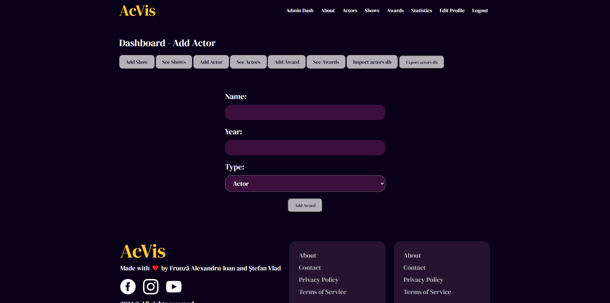

### Hardware interface

- The application will run on a server.

- The application will require an internet connection to access external data sources.

- The application will require a computer or mobile device to access the user interface.

### Software interface

- The application will use a RESTful API to communicate with the server.

- The application will be accessed through a web browser.

- The application will use JavaScript to interact with the user interface.

### Communication interface

- The application will use HTTP to communicate with the server.

- The application will use JSON to send and receive data.

## Characteristics of the application

### Account Management
#### Description and Generalities
- A user can register by choosing a username, an email, a password, first name, and last name. They can authenticate themselves by only needing the username and password.
#### Information Update
- When a new user is created, their credentials are entered into the database. Similarly, when the user decides to modify their credentials, the new values are also updated in the database.
####  Operating Conditions
- To modify their credentials, the user must be authenticated.
- To authenticate, the user needs an account registered in the database.

### Admin Section
#### Description and Generalities
- The Admin Section is intended for users with administrator rights, providing them with facilities that a normal user does not have. When the admin accesses the admin dashboard, they can view a list of shows, actors, awards, add and delete them, or import/export actors via CSV.
#### Information Update
- When the admin adds an actor, show or award, the information is inserted into the database.
- When the admin modifies an actor, show or award, the information is updated in the database.
#### Operating Conditions
- The user must be authenticated.
- The user must have admin rights.

### Session management

#### Description

- The application will have a session management system that will allow users to log in and log out.

- The session management system will be implemented using JWT tokens.

- The session management system will have a timeout of 30 minutes.

#### Data flow

- The user will log in using the login form.

- The server will validate the user's credentials.

- The server will generate a JWT token and send it to the user.

- The user will store the token in the local storage.

- The user will send the token in the header of each request.

#### Requirements and constraints

- The user must have an account to log in.

- The user must have a valid email and password to log in.

- The user must have a valid JWT token to access the application.

### Other functionalities

#### Description

- The application will allow users to see the details of an actor or a movie.

- The application will allow users to see the connections between actors and movies.

#### Data flow

- The user will access a show/actor page.

- The application will send a request to the server.

- The server will search for the actor or show in the database.

- The server will send the results to the user.

- The user will see the results on the screen.

#### Requirements and constraints

- The user must have an internet connection to use the application.

- The user must have a valid JWT token to access the application.

- The user must have an account to log in.

## Technologies for protection and security

### Description

- The application will encrypt the user's password before storing it in the database.

#### Data security

- Authorization is done with JWT tokens.

- Passwords are hashed with Bcrypt.

- The application is using prepared statements to prevent SQL injection.

#### Software qualities

- The application is using a layered architecture to separate concerns.

- The application is using a RESTful API to separate the client from the server.

- The application is using a JWT token to authenticate users.
 
 

 

